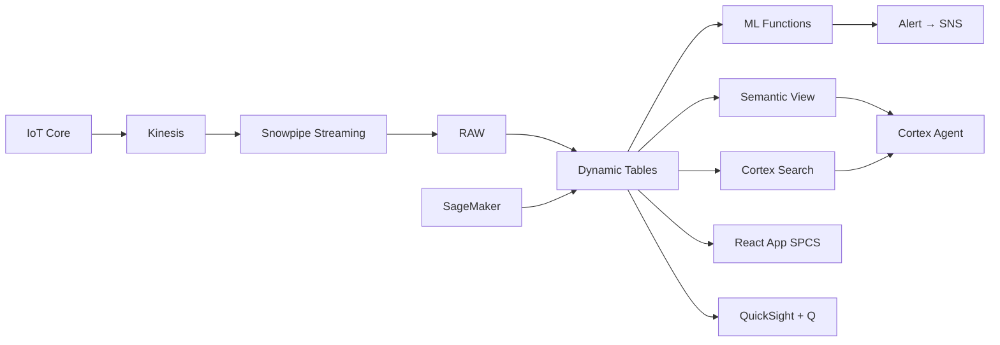

# Assembly Line Digital Twin

Digital twin of 8 automotive assembly lines across Thailand's Eastern Seaboard — IoT TwinMaker syncs with Snowflake ML to predict downtime, detect anomalies, and visualize real-time production in a React Canvas.

## Architecture

Thailand's automotive assembly plants run 8 lines producing pickups and SUVs for Toyota, Honda, and Isuzu. Unplanned downtime costs ฿420M per quarter — but traditional SCADA systems detect failures only after they happen. A digital twin powered by IoT TwinMaker visualization and Snowflake ML predicts failures 4-7 days early.



## Snowflake Capabilities

| Capability | Implementation |
|-----------|---------------|
| Dynamic Tables | LINE_OEE_REALTIME / EQUIPMENT_HEALTH_SCORE / DOWNTIME_COST / VIBRATION_TIMESERIES |
| ML Functions | ML.FORECAST + ML.ANOMALY_DETECTION |
| Cortex AI | COMPLETE, AI_CLASSIFY, SUMMARIZE |
| Cortex Search | 5000 documents indexed |
| Cortex Agent | ASSEMBLY_TWIN_AGENT |
| Semantic View | ASSEMBLY_ANALYTICS |
| React App (SPCS) | 5 tabs + DemoGuide |


## AWS Services

| Service | Role in Demo |
|---------|-------------|
| AWS IoT Core | Ingest assembly line sensor telemetry (750K readings) |
| AWS IoT TwinMaker | 3D digital twin visualization of assembly lines |
| Amazon Kinesis | Stream production events for real-time OEE |
| Amazon SageMaker | Predictive maintenance model for equipment failure |
| Amazon SNS | Alert maintenance team on predicted failures |
| Amazon QuickSight + Q | OEE and downtime analytics dashboard |


## Personas

| Persona | Role | Key Questions |
|---------|------|---------------|
| **Chaiwat Sriprasert** | Plant Director | "What's our OEE across all 8 lines today?" "Which stations are causing the most downtime?" |
| **Waraporn Jittamanee** | Maintenance Engineering Manager | "Which robots are showing degradation patterns?" "What's the predicted time-to-failure for Station W-12?" |


## Data

| Table | Rows | Description |
|-------|------|-------------|
| ASSEMBLY_LINES | 8 | Assembly lines across 3 plants (body, paint, trim, final) |
| STATIONS | 240 | Work stations with robot and equipment details |
| EQUIPMENT_TELEMETRY | 750,000 | IoT sensor data (vibration, temperature, current, cycle time) |
| PRODUCTION_EVENTS | 45,000 | Production start/stop/downtime events with reason codes |
| MAINTENANCE_RECORDS | 5,000 | Work orders, PM schedules, breakdown history |
| TWINMAKER_SCENES | 8 | IoT TwinMaker scene metadata for 3D visualization |
| SPARE_PARTS_INVENTORY | 1,200 | Critical spare parts stock levels and lead times |
| THAI_AUTO_PRODUCTION | 12 | Thailand automotive production statistics |


## Build Instructions

### Prerequisites
- Snowflake account with ACCOUNTADMIN access
- Cortex AI enabled (ML Functions, Search, Agent)
- Warehouse: ASSEMBLY_WH (Medium)
- AWS CLI with access (us-west-2)

### Deployment

```bash
snowsql -f snowflake/00_setup.sql
snowsql -f snowflake/01_marketplace_install.sql
snowsql -f snowflake/02_raw_tables.sql
snowsql -f snowflake/03_staging.sql
snowsql -f snowflake/04_dynamic_tables.sql
snowsql -f snowflake/05_search.sql
snowsql -f snowflake/06_ml_models.sql
snowsql -f snowflake/07_semantic_view.sql
snowsql -f snowflake/08_agent.sql
```

### React App (SPCS)
```bash
cd app && npm ci && npm run build
docker build -t aws-thailand-automotive-assembly-twin-app .
docker push bdiqc8sm-default.registry.snowflakecomputing.com/assembly_twin/app/aws_thailand_automotive_assembly_twin/app:latest
```

### Demo Mode
Open the app URL with `?demo=true` for presenter view.

## Build Modes

### Snowflake Only
Run scripts 00-08 (skip AWS-specific integration). Uses:
- **Snowpipe Streaming SDK** instead of AWS IoT Core
- **React Canvas (SPCS) with Snowflake data layer** instead of AWS IoT TwinMaker
- **Snowpipe Streaming SDK (direct)** instead of Amazon Kinesis
- **ML.ANOMALY_DETECTION + ML.FORECAST** instead of Amazon SageMaker
- **Alerts + Notification Integration** instead of Amazon SNS
- **Snowflake Intelligence (Cortex Analyst)** instead of Amazon QuickSight + Q

### Full AWS + Snowflake
Run all scripts including AWS integration. Deploy QuickSight dashboard from `quicksight/`.

## Business Impact

Industry research and Snowflake customer outcomes:
- **Thailand's automotive sector contributes 12% of GDP with 1.88M vehicles produced in 2023** — [FTI Thailand](https://www.fti.or.th/eng/)
- **Predictive maintenance reduces unplanned downtime by 30-50% and maintenance costs by 10-25%** — [McKinsey Industry 4.0](https://www.mckinsey.com/capabilities/operations/our-insights)
- **Digital twins in manufacturing improve OEE by 5-15% through real-time optimization** — [Deloitte Smart Factory](https://www2.deloitte.com/us/en/insights/focus/industry-4-0/smart-factory-connected-manufacturing.html)
- **Toyota Thailand's Gateway plant produces 300,000 vehicles annually with Industry 4.0 systems** — [Toyota Thailand](https://www.toyota.co.th/en)


## Key Demo Numbers

- **฿420M** unplanned downtime cost this quarter (US$12M)
- **72.3% OEE** average across 8 lines (target: 85%)
- **19 stations** showing equipment degradation patterns
- **4 days** predicted time-to-failure for Station W-12 (ML.FORECAST)
- **750K readings** ingested daily via IoT Core → Snowpipe Streaming
- **240 stations** monitored across 8 assembly lines in 3 plants


## License

Apache 2.0 — See [LICENSE](LICENSE) for details.

This is a personal demo project and is not an official Snowflake offering. It comes with no support or warranty.